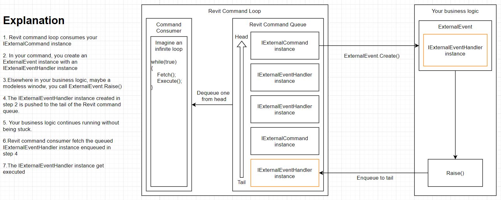
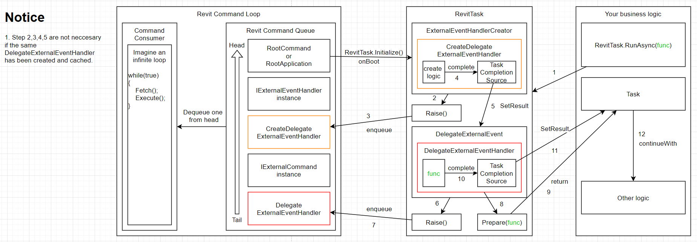

# Revit.Async
Use Task-based asynchronous pattern (TAP) to run Revit API code from any execution context.

[中文说明](说明.md)

# Background

If you have ever encountered a Revit API exception saying "Cannot execute Revit API outside of Revit API context",
typically when you want to execute Revit API code from a modeless window, you may need this library to save your life.

A common solution for this exception is to wrap the Revit API code using `IExternalEventHandler` and register the handler instance to Revit ahead of time to get a trigger (`ExternalEvent`).
To execute the handler, just raise the trigger from anywhere to queue the handler to the Revit command loop.
But there comes another problem.
After raising the trigger, within the same context, you have no idea when the handler will be executed and it's not easy to get some result generated from that handler.
If you do want to make this happen, you have to manually yield the control back to the calling context.

This solution looks quite similar to the mechanism of "Promise" if you are familiar with JavaScript ES6.
Actually we can achieve all the above logic by making use of task-based asynchronous pattern (TAP) which is generally known as `Task<T>` in .NET.
By adopting Revit.Async, it is possible to run Revit API code from any context, because internally Revit.Async wraps your code automatically with `IExternalEventHandler` and yields the return value to the calling context to make your invocation more natural.

Here is a [diagram comparing the Revit API external event mechnism with Revit.Async](https://drive.google.com/file/d/1sb6Yrlt6zjkE9XBh4UB5sWV_i8nTpkmG/view?usp=sharing) and screenshots of the two main parts:

Alternatively, take a look at these legacy screenshots:

## Revit API External Event



## Revit.Async


If you are not familiar with Task-based asynchronous pattern (TAP), here is some useful material provided by Microsoft:

https://docs.microsoft.com/en-us/dotnet/standard/asynchronous-programming-patterns/task-based-asynchronous-pattern-tap

https://docs.microsoft.com/en-us/dotnet/csharp/programming-guide/concepts/async/task-asynchronous-programming-model

# Examples

## Standard approach (without Revit.Async)

```csharp

[Transaction(TransactionMode.Manual)]
public class MyRevitCommand : IExternalCommand
{
    public static ExternalEvent SomeEvent { get; set; }
    public Result Execute(ExternalCommandData commandData, ref string message, ElementSet elements)
    {
        //Register MyExternalEventHandler ahead of time
        SomeEvent = ExternalEvent.Create(new MyExternalEventHandler());
        var window = new MyWindow();
        //Show modeless window
        window.Show();
        return Result.Succeeded;
    }
}

public class MyExternalEventHandler : IExternalEventHandler
{
    public void Execute(UIApplication app)
    {
        //Running some Revit API code here to handle the button click
        //It's complicated to accept argument from the calling context and return value to the calling context
        var families = new FilteredElementCollector(app.ActiveUIDocument.Document)
                            .OfType(typeof(Family))
                            .ToList();
        //ignore some code
    }
}

public class MyWindow : Window
{
    public MyWindow()
    {
        InitializeComponents();
    }

    private void InitializeComponents()
    {
        Width                 = 200;
        Height                = 100;
        WindowStartupLocation = WindowStartupLocation.CenterScreen;
        var button = new Button
        {
            Content             = "Button",
            Command             = new ButtonCommand(),
            VerticalAlignment   = VerticalAlignment.Center,
            HorizontalAlignment = HorizontalAlignment.Center
        };
        Content = button;
    }
}

public class ButtonCommand : ICommand
{    
    public bool CanExecute(object parameter)
    {
        return true;
    }

    public event EventHandler CanExecuteChanged;

    public void Execute(object parameter)
    {
        //Running Revit API code directly here will result in a "Running Revit API outside of Revit API context" exception
        //Raise a predefined ExternalEvent instead
        MyRevitCommand.SomeEvent.Raise();
    }
}
```

## Revit.Async Approach

```csharp
[Transaction(TransactionMode.Manual)]
public class MyRevitCommand : IExternalCommand
{
    public Result Execute(ExternalCommandData commandData, ref string message, ElementSet elements)
    {
        //Always initialize RevitTask ahead of time within Revit API context
        RevitTask.Initialze();
        var window = new MyWindow();
        //Show modeless window
        window.Show();
        return Result.Succeeded;
    }
}

public class MyWindow : Window
{
    public MyWindow()
    {
        InitializeComponents();
    }

    private void InitializeComponents()
    {
        Width                 = 200;
        Height                = 100;
        WindowStartupLocation = WindowStartupLocation.CenterScreen;
        var button = new Button
        {
            Content             = "Button",
            Command             = new ButtonCommand(),
            CommandParameter    = true,
            VerticalAlignment   = VerticalAlignment.Center,
            HorizontalAlignment = HorizontalAlignment.Center
        };
        Content = button;
    }
}

public class ButtonCommand : ICommand
{    
    public bool CanExecute(object parameter)
    {
        return true;
    }

    public event EventHandler CanExecuteChanged;

    public async void Execute(object parameter)
    {
        //.NET 4.5 supported keyword, use ContinueWith if using .NET 4.0
        var families = await RevitTask.RunAsync(
            app => 
            {
                //Run Revit API code here
                
                //Taking advantage of the closure created by the lambda expression,
                //we can make use of the argument passed into the Execute method.
                //Let's assume it's a boolean indicating whether to filter families that is editable
                if(parameter is bool editable)
                {
                    return new FilteredElementCollector(app.ActiveUIDocument.Document)
                        .OfType(typeof(Family))
                        .Cast<Family>()
                        .Where(family => editable ? family.IsEditable : true)
                        .ToList();
                }
                
                return null;
            });
        
        MessageBox.Show($"Family count: {families?.Count ?? 0}");
    }
}
```

## Define your own handler

Fed up with the weak `IExternalEventHandler` interface?
Use the `IGenericExternalEventHandler<TParameter,TResult>` interface instead.
It provides you with the ability to pass argument to a handler and receive result on complete.

It's always recommended to derive from the predefined abstract classes; they are designed to handle the argument passing and result returning part.

| Class                                                   | Description                       |
| ------------------------------------------------------- | --------------------------------- |
| `AsyncGenericExternalEventHandler<TParameter, TResult>` | Use to execute asynchronous logic |
| `SyncGenericExternalEventHandler<TParameter, TResult>`  | Use to execute synchronize logic  |

```csharp
[Transaction(TransactionMode.Manual)]
public class MyRevitCommand : IExternalCommand
{
    public Result Execute(ExternalCommandData commandData, ref string message, ElementSet elements)
    {
        RevitTask.Initialize();
        //Register SaveFamilyToDesktopExternalEventHandler ahead of time
        RevitTask.RegisterGlobal(new SaveFamilyToDesktopExternalEventHandler());
        var window = new MyWindow();
        //Show modeless window
        window.Show();
        return Result.Succeeded;
    }
}

public class MyWindow : Window
{
    public MyWindow()
    {
        InitializeComponents();
    }

    private void InitializeComponents()
    {
        Width                 = 200;
        Height                = 100;
        WindowStartupLocation = WindowStartupLocation.CenterScreen;
        var button = new Button
        {
            Content             = "Save Random Family",
            Command             = new ButtonCommand(),
            CommandParameter    = true,
            VerticalAlignment   = VerticalAlignment.Center,
            HorizontalAlignment = HorizontalAlignment.Center
        };
        Content = button;
    }
}

public class ButtonCommand : ICommand
{    
    public bool CanExecute(object parameter)
    {
        return true;
    }

    public event EventHandler CanExecuteChanged;

    public async void Execute(object parameter)
    {
        var savePath = await RevitTask.RunAsync(
            async app =>
            {
                try
                {
                    var document = app.ActiveUIDocument.Document;
                    var randomFamily = await RevitTask.RunAsync(
                        () =>
                        {
                            var families = new FilteredElementCollector(document)
                                .OfClass(typeof(Family))
                                .Cast<Family>()
                                .Where(family => family.IsEditable)
                                .ToArray();
                            var random = new Random(Environment.TickCount);
                            return families[random.Next(0, families.Length)];
                        });

                    //Raise your own handler
                    return await RevitTask.RaiseGlobal<SaveFamilyToDesktopExternalEventHandler, Family, string>(randomFamily);
                }
                catch (Exception)
                {
                    return null;
                }
            });
        var saveResult = !string.IsNullOrWhiteSpace(savePath);
        MessageBox.Show($"Family {(saveResult ? "" : "not ")}saved:\n{savePath}");
        if (saveResult)
        {
            Process.Start(Path.GetDirectoryName(savePath));
        }
    }
}

public class SaveFamilyToDesktopExternalEventHandler : 			
	SyncGenericExternalEventHandler<Family, string>
{
    public override string GetName()
    {
        return "SaveFamilyToDesktopExternalEventHandler";
    }

    protected override string Handle(UIApplication app, Family parameter)
    {
        //write sync logic here
        var document       = parameter.Document;
        var familyDocument = document.EditFamily(parameter);
        var desktop = Environment.GetFolderPath(Environment.SpecialFolder.DesktopDirectory);
        var path = Path.Combine(desktop, $"{parameter.Name}.rfa");
        familyDocument.SaveAs(path, new SaveAsOptions {OverwriteExistingFile = true});
        return path;
    }
}
```

# Todo

- Check current context to decide whether to create an IExternalEventHandler or to run code directly
- Support progress
- Support cancellation

# Issues

Feel free to contact me by 303353762@qq.com if you have any issue using this library.
